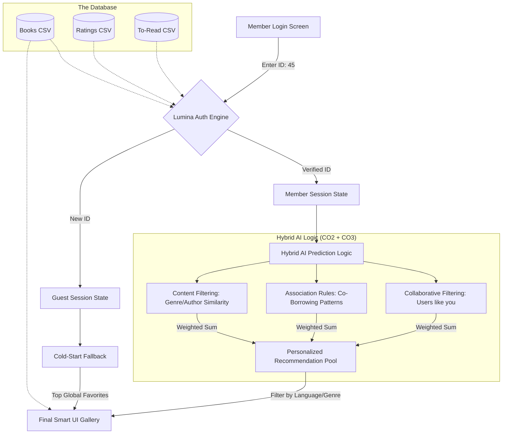

# 🏛️ Lumina: System Architecture & User Journey

This visualization explains how the **Smart Library Recommender** works from the perspective of a user and the internal AI engine.

## 🏗️ System Architecture Flow

---

## 🛤️ The Journey of Member #45

| Stage | Activity | System Logic |
| :--- | :--- | :--- |
| **1. Portal Entry** | User enters ID `45`. | The system performs a **Database Lookup** in the User-Item Matrix. |
| **2. Intelligence Hub** | User lands on "Neural Predictions". | The engine pulls **User 45's history**. It finds they previously read *Classic Mystery*. |
| **3. Hybrid Matching** | System shows 10 new books. | **Engine CO2** finds users similar to #45. **Engine CO3** finds books frequently borrowed with mysteries. |
| **4. Interaction** | User clicks "Borrow Now". | A **real-time toast** confirms the choice. The session state is updated to reflect this activity. |
| **5. Wishlist Sync** | User opens "My Wishlist". | The system queries `to_read.csv` for `user_id == 45` and renders their saved books with a yellow badge. |

---

## ❄️ Cold Start Logic (For New Users)

If a user enters a **New ID** (e.g., `99999`):
1.  **Detection**: The AI detects zero history in the User-Item matrix.
2.  **Fallback**: Instead of a "blank" screen, it activates the **Cold Start Protocol**.
3.  **Recommendations**: It serves the top-rated, most popular books from the library (General Favorites) to help the new user start their journey.
4.  **UI Feedback**: A special "Cold Start Engine Engaged" notification appears for transparency.
